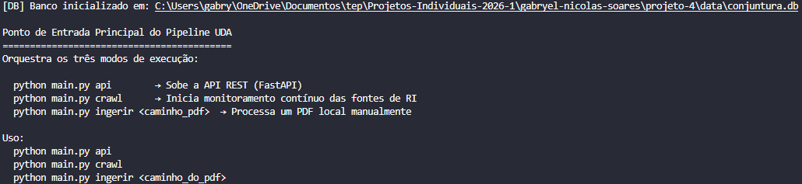
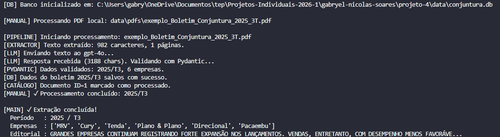
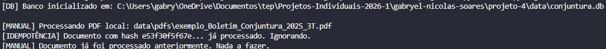

# Pipeline UDA — Conjuntura do Setor Habitacional

> **Projeto 4 — Análise de Dados Não Estruturados (UDA)**  
> Aluno: Gabryel Nicolas Soares de Sousa  
> Matrícula: 221022570  
> Ministério das Cidades | Engenharia de Dados Inteligente

---

## Visão Geral

Pipeline automatizado que coleta, processa e serve dados operacionais das principais construtoras brasileiras a partir de PDFs publicados nas Centrais de Resultados (RI) de cada empresa.

```
Sites de RI (PDF) → Crawler → Extrator LLM (GPT-4) → SQLite → API REST
```

---

## Arquitetura

```
projeto-4/
├── main.py                     # Ponto de entrada (api | crawl | ingerir)
├── requirements.txt            # Dependências do projeto
├── .env.example                # Modelo de variáveis de ambiente
├── .gitignore
├── README.md
│
├── models/
│   ├── __init__.py
│   └── schema.py               # Contrato Semântico Pydantic
│
├── extractor/
│   ├── __init__.py
│   └── pdf_extractor.py        # Full-Scan + GPT-4 + validação
│
├── crawler/
│   ├── __init__.py
│   └── ri_crawler.py           # Polling das centrais de RI + idempotência
│
├── db/
│   ├── __init__.py
│   └── database.py             # SQLite + Catálogo de Linhagem
│
├── api/
│   ├── __init__.py
│   └── main.py                 # FastAPI REST
│
└── images/
    ├── teste-1.png             # Evidência: banco inicializado
    ├── teste-2.png             # Evidência: PDF processado pelo GPT-4
    ├── teste-3.png             # Evidência: idempotência
    ├── teste-4.png             # Evidência: API retornando JSON
    ├── teste-5.png             # Evidência: Swagger UI
    └── teste-6.png             # Evidência: catálogo de linhagem
```

> A pasta `data/` (banco SQLite + PDFs) é gerada automaticamente e não está versionada.

---

## Decisões Arquiteturais

### 1. Estratégia de Extração: Full-Scan

**Justificativa:** O Boletim de Conjuntura é um documento curto (1–3 páginas) com tabelas concentradas em poucas seções. A estratégia Full-Scan envia o texto integral ao GPT-4, garantindo que o modelo veja o contexto completo sem risco de perda de dados entre chunks. O custo de tokens para documentos desta dimensão é desprezível frente à simplicidade e confiabilidade da abordagem.

> Chunking semântico seria indicado apenas para relatórios extensos (50+ páginas) com muito conteúdo irrelevante intercalado.

### 2. Gatilho de Ingestão: Polling / CronJob

**Justificativa:** As centrais de RI das construtoras brasileiras não expõem webhooks ou feeds RSS padronizados. O polling agendado (padrão: 1x/dia via `schedule`) é a estratégia mais compatível com a realidade dos portais e não sobrecarrega os servidores externos.

### 3. Idempotência: Hash SHA-256

**Justificativa:** Antes de acionar o LLM (gerando custos de API), o sistema calcula o hash SHA-256 do conteúdo real do PDF e consulta o Catálogo de Dados. Se o hash já existir com status `processado`, o arquivo é ignorado — evitando reprocessamento custoso de documentos já conhecidos.

### 4. Contrato Semântico: Pydantic

O schema `BoletimConjuntura` (em `models/schema.py`) é o filtro de qualidade do pipeline:
- Todos os campos numéricos aceitam `None` (NULL) — nunca alucina valores ausentes
- O validador `parse_percentual` normaliza `"-32%"` → `-32.0` automaticamente
- O prompt do sistema instrui o LLM a retornar `null` quando um valor não está presente

### 5. Linhagem de Dados (Data Lineage)

Cada linha do banco (`boletim_conjuntura`) está associada ao documento de origem via `fk_documento_id`, que aponta para o registro em `catalogo_documentos` contendo URL de origem, hash SHA-256 e timestamps.

---

## Instalação

```bash
# 1. Entrar no diretório
cd gabryel-nicolas-soares/projeto-4

# 2. Criar ambiente virtual com Python 3.11
py -3.11 -m venv .venv

# 3. Ativar o ambiente
.venv\Scripts\activate        # Windows
source .venv/bin/activate     # Mac/Linux

# 4. Instalar dependências
pip install -r requirements.txt

# 5. Configurar variáveis de ambiente
copy .env.example .env        # Windows
cp .env.example .env          # Mac/Linux
# Abra o .env e insira sua OPENAI_API_KEY
```

---

## Uso

### Processar um PDF local

```bash
python main.py ingerir data/pdfs/exemplo_Boletim_Conjuntura_2025_3T.pdf
```

### Subir a API REST

```bash
python main.py api
# Acesse: http://localhost:8000/docs
```

### Iniciar monitoramento contínuo das fontes de RI

```bash
python main.py crawl
```

---

## Evidências de Funcionamento

### Teste 1 — Banco inicializado com sucesso

```
[DB] Banco inicializado em: .../projeto-4/data/conjuntura.db

Uso:
  python main.py api
  python main.py crawl
  python main.py ingerir <caminho_do_pdf>
```



---

### Teste 2 — PDF processado pelo GPT-4

```
[MANUAL] Processando PDF local: data\pdfs\exemplo_Boletim_Conjuntura_2025_3T.pdf
[CATÁLOGO] Documento registrado. ID=1, arquivo=exemplo_Boletim_Conjuntura_2025_3T.pdf
[PIPELINE] Iniciando processamento: exemplo_Boletim_Conjuntura_2025_3T.pdf
[EXTRACTOR] Texto extraído: 982 caracteres, 1 páginas.
[LLM] Enviando texto ao gpt-4o...
[LLM] Resposta recebida (3188 chars). Validando com Pydantic...
[PYDANTIC] Dados validados: 2025/T3, 6 empresas.
[DB] Dados do boletim 2025/T3 salvos com sucesso.
[CATÁLOGO] Documento ID=1 marcado como processado.

[MAIN] ✓ Extração concluída!
  Período   : 2025 / T3
  Empresas  : ['MRV', 'Cury', 'Tenda', 'Plano & Plano', 'Direcional', 'Pacaembu']
  Editorial : GRANDES EMPRESAS CONTINUAM REGISTRANDO FORTE EXPANSÃO NOS LANÇAMENTOS...
```



---

### Teste 3 — Idempotência garantida

Ao rodar o mesmo PDF pela segunda vez, o sistema ignora sem chamar o GPT-4:

```
[MANUAL] Processando PDF local: data\pdfs\exemplo_Boletim_Conjuntura_2025_3T.pdf
[IDEMPOTÊNCIA] Documento com hash e53f30f5... já processado. Ignorando.
[MANUAL] Documento já foi processado anteriormente. Nada a fazer.
```



---

### Teste 4 — API REST retornando dados estruturados

**Endpoint:** `GET /api/conjuntura?ano=2025&trimestre=3`

```json
[
  {
    "empresa": "MRV",
    "ano": 2025,
    "trimestre": 3,
    "lanc_vs_tri_anterior": -32.0,
    "lanc_vs_mesmo_tri_ano_ant": -19.0,
    "lanc_acum_9m_ano_ant": 96.0,
    "lanc_acum_9m_atual": 20.0,
    "vend_vs_tri_anterior": -12.0,
    "vend_vs_mesmo_tri_ano_ant": -10.0,
    "vend_acum_9m_ano_ant": 9.0,
    "vend_acum_9m_atual": -5.0,
    "url_origem": "local://...exemplo_Boletim_Conjuntura_2025_3T.pdf",
    "hash_documento": "e53f30f5f67ebc739041680133ef33bedc87446cba7bb41ee9fbb0c4f3e65661",
    "data_processamento": "2026-06-08T02:37:53.665189"
  }
]
```


---

### Teste 5 — Swagger UI com endpoints documentados


---

### Teste 6 — Catálogo de Linhagem

**Endpoint:** `GET /api/catalogo`

```json
[
  {
    "id": 1,
    "hash_sha256": "e53f30f5f67ebc739041680133ef33bedc87446cba7bb41ee9fbb0c4f3e65661",
    "url_origem": "local://...exemplo_Boletim_Conjuntura_2025_3T.pdf",
    "nome_arquivo": "exemplo_Boletim_Conjuntura_2025_3T.pdf",
    "empresa_fonte": "Manual",
    "data_coleta": "2026-06-08T02:33:38.477750",
    "data_processamento": "2026-06-08T02:37:53.665189",
    "status": "processado",
    "ano_referencia": 2025,
    "trimestre_referencia": 3
  }
]
```


---

## Endpoints da API

| Método | Endpoint | Descrição |
|--------|----------|-----------|
| `GET` | `/api/conjuntura` | Lista todos os dados (filtros: `empresa`, `ano`, `trimestre`) |
| `GET` | `/api/conjuntura/totais` | Totais agregados do setor |
| `GET` | `/api/catalogo` | Catálogo de documentos com linhagem |
| `GET` | `/api/catalogo/{hash}` | Detalhe de um documento pelo hash SHA-256 |
| `POST` | `/api/ingerir` | Dispara ingestão de PDF local ou por URL |
| `GET` | `/health` | Health check |

### Exemplos de consulta

```bash
# Dados da MRV no 3T25
GET /api/conjuntura?empresa=MRV&ano=2025&trimestre=3

# Todos os dados de 2025
GET /api/conjuntura?ano=2025

# Catálogo completo de documentos processados
GET /api/catalogo?status=processado
```

---

## Modelo de Dados

### `catalogo_documentos` (linhagem)

| Campo | Tipo | Descrição |
|-------|------|-----------|
| `hash_sha256` | TEXT UNIQUE | Fingerprint do arquivo (idempotência) |
| `url_origem` | TEXT | Link do PDF no site de RI |
| `empresa_fonte` | TEXT | Empresa publicadora |
| `data_coleta` | TEXT | Timestamp da coleta |
| `data_processamento` | TEXT | Timestamp do processamento LLM |
| `status` | TEXT | `pendente` \| `processado` \| `erro` |

### `boletim_conjuntura` (dados extraídos)

| Campo | Tipo | Descrição |
|-------|------|-----------|
| `fk_documento_id` | INTEGER | Linhagem → `catalogo_documentos.id` |
| `empresa` | TEXT | Nome da construtora |
| `ano` / `trimestre` | INTEGER | Período de referência |
| `lanc_vs_tri_anterior` | REAL | Var. % lançamentos vs trimestre anterior |
| `vend_vs_tri_anterior` | REAL | Var. % vendas vs trimestre anterior |
| *(+ 6 campos similares)* | REAL | Ver schema completo em `models/schema.py` |

---

## Fontes Monitoradas

| Empresa | Portal de RI |
|---------|-------------|
| MRV | ri.mrv.com.br |
| Cury | ri.cury.com.br |
| Tenda | ri.construtora-tenda.com |
| Plano & Plano | ri.planoplano.com.br |
| Direcional | ri.direcional.com.br |
| Pacaembu | ri.pacaembu.com |

---

## Tecnologias

| Componente | Tecnologia | Motivo |
|-----------|-----------|--------|
| Parser PDF | PyMuPDF | Rápido, sem regras rígidas de layout |
| LLM | GPT-4o (OpenAI) | Extração semântica sem expressões regulares |
| Validação | Pydantic v2 | Contrato forte, validadores customizados |
| Banco | SQLite | Zero configuração, portável |
| API | FastAPI | Tipagem nativa, Swagger automático |
| Crawler | requests + BeautifulSoup | Scraping dos portais de RI |
| Agendamento | schedule | Polling periódico sem infraestrutura externa |